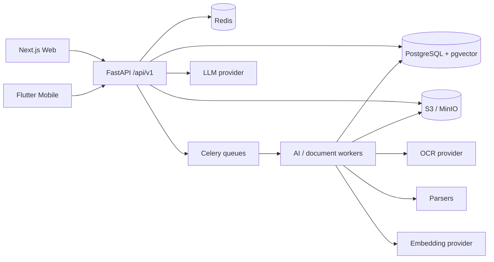
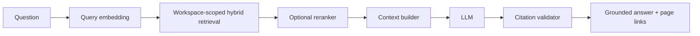

# DocMind

**DocMind** is a production-oriented AI document workspace for turning private files into searchable, citation-grounded knowledge. It is designed as a real SaaS product rather than a PDF-chat demo: users can organize documents into workspaces, search semantically and lexically, chat across one or many sources, inspect page-level citations, generate summaries, notes, flashcards and quizzes, compare documents, and extract structured data.

> Current status: portfolio-ready foundation with the end-to-end ingestion/RAG architecture, web workspace, Flutter client foundation, Docker environment, deterministic AI test mode, CI, security tests, and technical documentation. Provider adapters and product surfaces are intentionally replaceable and extensible.

## Product highlights

- Multi-tenant **personal and shared workspaces** with owner/admin/editor/viewer authorization.
- PDF, DOCX, PPTX, TXT, Markdown, CSV and image ingestion.
- **Scanned PDF/image OCR** through a provider interface; local Tesseract supports Arabic + English.
- Structure-aware chunking that preserves page ranges, sections and source metadata.
- Hybrid retrieval that combines deterministic/semantic embeddings with exact/keyword signals.
- PostgreSQL + **pgvector HNSW** production path and deterministic SQLite test path.
- Grounded RAG with source IDs, citation validation, page-level deep links and unsupported-answer handling.
- Streaming-compatible conversation API and persistent message/citation records.
- Summaries, notes, collections, saved prompts, document comparison and schema-validated extraction.
- Flashcards with SM-2 scheduling, quizzes and source-linked study content.
- English + Arabic product architecture, RTL web switching and Arabic OCR configuration.
- Privacy-conscious admin aggregates, usage/entitlement architecture, audit logs and session management.
- S3-compatible object storage (MinIO locally), Redis/Celery queues, Docker Compose and optional Ollama.
- No paid AI credentials required for development or CI.

## Screenshots

> Add portfolio screenshots here after deploying the web/mobile builds.

| Dashboard | Document + AI workspace | Mobile study |
|---|---|---|
| `docs/screenshots/dashboard.png` | `docs/screenshots/document-chat.png` | `docs/screenshots/mobile-study.png` |

## Architecture



See [`docs/architecture.md`](docs/architecture.md) and [`docs/rag.md`](docs/rag.md) for the detailed flow.

## Monorepo

```text
apps/
  web/                 Next.js + TypeScript + Tailwind workspace
  mobile/              Flutter + Riverpod + GoRouter client
services/
  api/                 FastAPI, SQLAlchemy, AI/RAG domain services
  worker/              Worker service entrypoint/reference
scripts/               Demo seeding and deterministic RAG evaluation
docs/                  Architecture, RAG, OCR, citations, security, deployment
.github/workflows/      CI for API, web and Flutter
Dockerfile.api
Dockerfile.worker
Dockerfile.web
docker-compose.yml
```

## Run locally

### Docker — recommended

```bash
cp .env.example .env
docker compose up -d --build
```

Services:

- Web: `http://localhost:3000`
- API: `http://localhost:8000`
- OpenAPI: `http://localhost:8000/docs`
- MinIO console: `http://localhost:9001`

The default `.env.example` uses deterministic mock/hash AI so the application runs without paid credentials.

### Fully local AI

```bash
# update .env
AI_MODE=local
LLM_PROVIDER=ollama
EMBEDDING_PROVIDER=ollama

docker compose --profile local-ai up -d --build
# then pull your configured models inside Ollama
```

See [`docs/local-ai.md`](docs/local-ai.md).

## API development

```bash
cd services/api
python -m venv .venv
source .venv/bin/activate
pip install -e '.[dev]'
alembic upgrade head
uvicorn app.main:app --reload
```

Run tests:

```bash
pytest
```

The test suite uses SQLite and deterministic fake providers. External AI services are never required.

## Web development

```bash
cd apps/web
npm install
npm run dev
npm run typecheck
npm test
npm run build
```

The web workspace includes a desktop sidebar, command palette, dark mode, RTL switching, document library and a resizable document/AI/citation experience.

## Mobile development

The repository contains the Flutter application source. If native folders are not yet generated on a new clone, run:

```bash
cd apps/mobile
flutter create . --platforms=android,ios --org com.docmind --project-name docmind
flutter pub get
flutter analyze
flutter test
flutter run
```

CI performs the same platform bootstrap before building debug APK/AAB artifacts, so no signing credentials are required for CI validation.

## Document processing

```text
UPLOADED
  → VALIDATING
  → PARSING
  → OCR (when needed)
  → PAGE EXTRACTION
  → CLEANING / STRUCTURE-AWARE CHUNKING
  → EMBEDDING
  → INDEXING
  → READY
```

Each stage is retryable and tracked. Derived pages/chunks/embeddings are rebuilt idempotently, preventing duplicate vectors after retries.

## RAG and citations



DocMind never trusts arbitrary citation text emitted by a model. Source markers are resolved only against the actual retrieval set. Unknown source IDs are removed, and answers that fail to cite retrieved sources are flagged rather than silently presented as grounded.

## Evaluation

```bash
python scripts/evaluate_rag.py
```

The evaluator uses synthetic, redistributable content and reports:

```text
retrieval_accuracy
citation_accuracy
unsupported_claim_rate
```

See [`docs/rag.md`](docs/rag.md) for methodology.

## Security model

- Workspace role checks are server-side.
- Retrieval has a mandatory workspace predicate at the service boundary.
- Object access is permission-checked and S3 URLs are short-lived signed URLs.
- Refresh tokens are hashed, stored per device session and rotated on use.
- Passwords use Argon2.
- Uploads validate size/MIME/extension and expose a malware-scanning integration hook in the architecture.
- User documents are private by default.
- Document deletion cascades derived pages/chunks/embeddings and removes object-storage data.
- Account deletion cleans up owned-workspace object data before SQL cascades.
- Platform admin endpoints return aggregate health/usage data rather than arbitrary private document contents.

Read [`docs/security.md`](docs/security.md).

## Provider abstractions

The AI layer exposes replaceable interfaces for:

- `LLMProvider`
- `EmbeddingProvider`
- `OCRProvider`
- `RerankerProvider`

The repository includes deterministic hash embeddings and mock grounded generation for tests, Ollama adapters for local use, and environment configuration points for hosted providers.

## Queues

Production workers are separated by routing key:

- `document-processing`
- `ocr`
- `embedding`
- `ai`
- `exports`
- `notifications`

Workers acknowledge late, retry with backoff and expose job state in the database for admin visibility.

## CI

GitHub Actions validates:

- Python compile/lint/type/test + RAG security tests
- Next.js lint/type/test/build
- Flutter analyze/test/debug APK/debug AAB

No paid provider keys are used.

## Documentation

- [Architecture](docs/architecture.md)
- [RAG](docs/rag.md)
- [Document processing](docs/document-processing.md)
- [Citations](docs/citations.md)
- [OCR](docs/ocr.md)
- [Security](docs/security.md)
- [Local AI](docs/local-ai.md)
- [Deployment](docs/deployment.md)

## Roadmap

The architecture already reserves clean boundaries for production additions such as provider-specific hosted LLM adapters, richer table/bounding-box extraction, push notifications, team invitations, billing-provider integration, malware scanners, export workers, and advanced learned rerankers.

## License

Add the desired open-source or source-available license before redistribution.
