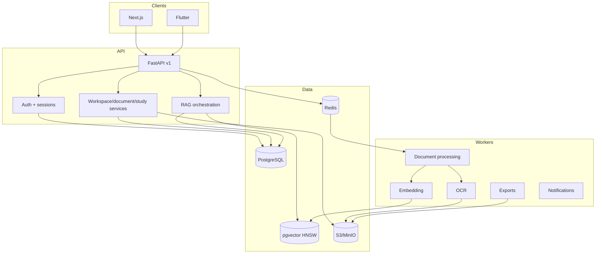

# Architecture

DocMind is a multi-tenant document knowledge platform. The design keeps interactive API work separate from expensive document/AI work and treats workspace authorization as a cross-cutting invariant.

## Boundaries

The API owns authentication, authorization, request validation, metadata and synchronous orchestration. Workers own expensive parsing/OCR/embedding/export work. Object storage owns original binaries; SQL stores metadata and derived text, never large source files.

Every workspace-owned row carries or is reachable through `workspace_id`. Authorization is checked before service invocation, and retrieval additionally enforces workspace filtering at its lowest boundary to protect against caller mistakes.

## Core entities

The SQL model includes users, sessions, workspaces/members, folders, documents/versions/pages/chunks/processing jobs, embeddings, conversations/messages/citations, collections, notes, saved prompts, flashcard decks/cards, quizzes/questions/attempts, tags, user settings, notifications, subscriptions, usage and audit logs.

## API conventions

All application endpoints are under `/api/v1`. Validation uses typed request models. Errors use HTTP status semantics and request IDs are returned in `x-request-id`. AI token streaming uses SSE because it is simple to proxy and reconnect.

## Multi-tenancy

Roles are ordered `viewer < editor < admin < owner`. Shared-workspace permission checks are server-side. Platform admin authority is distinct from workspace membership and intentionally does not expose private document bodies in normal admin endpoints.
