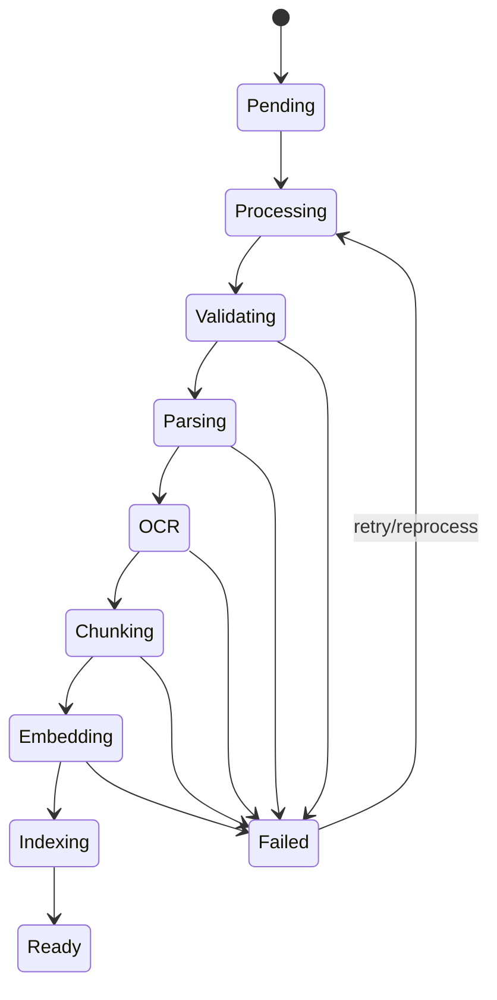

# Document processing

Uploads are written to object storage first, then represented by a `Document` row with hash, MIME type, size, object key and status. Production dispatches processing to Celery; development can use FastAPI background tasks for a zero-friction local loop.

Retries are idempotent. Pages and chunks are replaced as a unit and embedding uniqueness is enforced by `(chunk_id, provider, model)`. Document hash uniqueness within a workspace prevents accidental duplicate ingestion.

Scanned PDF pages are detected by low extracted-text volume, rasterized, and sent to OCR while retaining their original page number.
