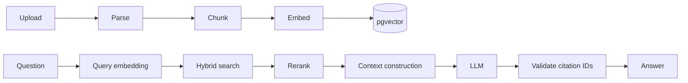

# RAG architecture

DocMind treats retrieval and citations as product-critical infrastructure rather than prompt decoration.

## Chunking

Chunks are built from pages, headings and paragraphs. Defaults are 650 approximate tokens with 100 tokens of paragraph-aware overlap. The chunk record keeps document ID, workspace ID, chunk index, page start/end, section title, token count and metadata.

## Embeddings

`EmbeddingProvider` is replaceable. CI uses deterministic feature hashing; local AI can use Ollama. Each embedding records provider, model and dimension so re-embedding is explicit when a model changes.

## Hybrid retrieval

Retrieval combines semantic similarity and keyword overlap. Exact phrase mode is supported. Production pgvector stores a native vector column with an HNSW cosine index; the portable JSON representation keeps deterministic SQLite tests possible. All candidate selection is workspace-scoped before ranking.

## Reranking

`RerankerProvider` is optional. Free/low-cost mode can use a no-op score-preserving reranker; paid/team configurations can attach a learned or hosted reranker without changing RAG orchestration.

## Context construction

Retrieved chunks are labeled `C1`, `C2`, etc. Context includes real document title, document ID, chunk ID and page number. The model is told to cite only those labels.

## Citation mapping

The model's output is not accepted as citation truth. Citation labels are parsed and resolved against the retrieval map. Unknown IDs are removed. Persisted `MessageCitation` records point to real chunk/document/page records and preserve source excerpts.

## Evaluation

`scripts/evaluate_rag.py` uses synthetic documents paired with expected pages. It measures:

- retrieval accuracy: expected source page appears in retrieved candidates;
- citation accuracy: emitted citation IDs map to retrieved source IDs/pages;
- unsupported claim rate: generated answers with no valid supporting citation when support is expected.

The suite is deterministic and does not call paid APIs.
